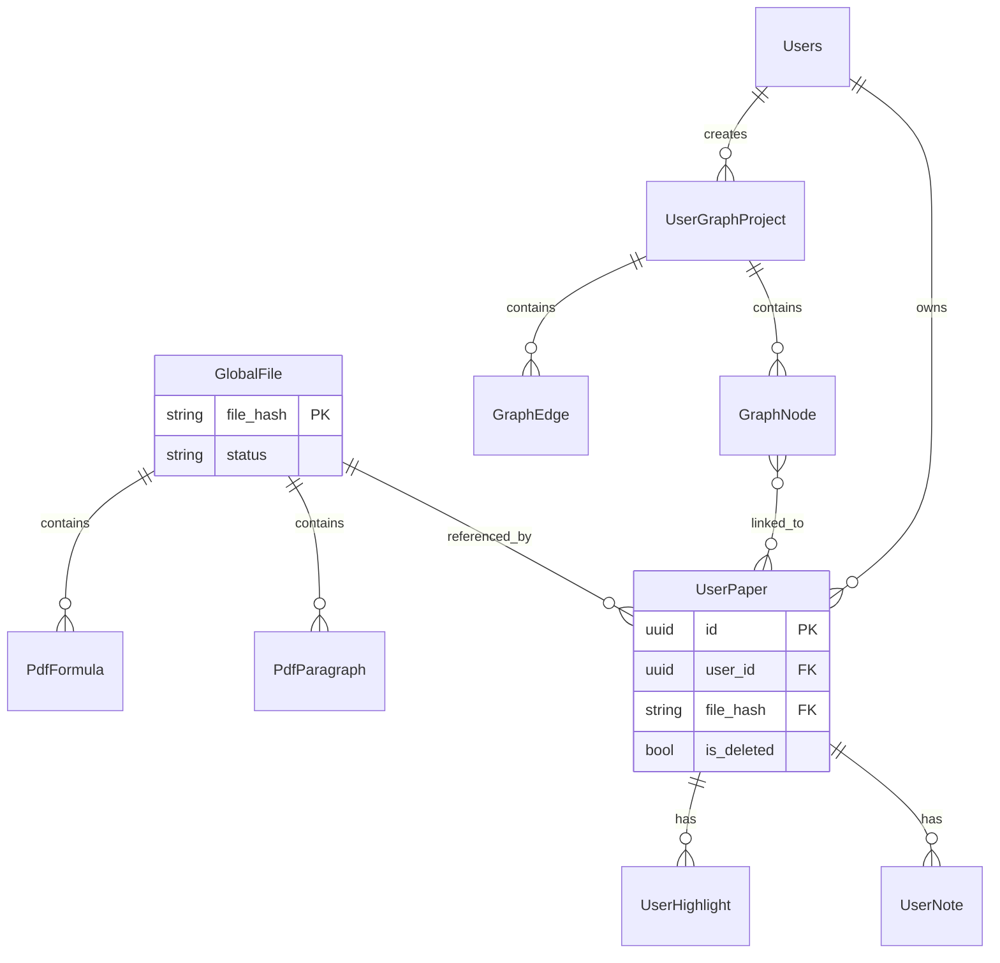

```mermaid
erDiagram
    Users ||--o{ UserPaper : "owns"
    GlobalFile ||--o{ UserPaper : "referenced_by"
    GlobalFile ||--o{ PdfParagraph : "contains"
    GlobalFile ||--o{ PdfFormula : "contains"
    UserPaper ||--o{ UserNote : "has"
    UserPaper ||--o{ UserHighlight : "has"
    
    %% 知识图谱
    Users ||--o{ UserGraphProject : "creates"
    UserGraphProject ||--o{ GraphNode : "contains"
    UserGraphProject ||--o{ GraphEdge : "contains"
    GraphNode }o--o{ UserPaper : "linked_to"

    GlobalFile {
        string file_hash PK
        string status
    }
    UserPaper {
        uuid id PK
        uuid user_id FK
        string file_hash FK
        bool is_deleted
    }
```